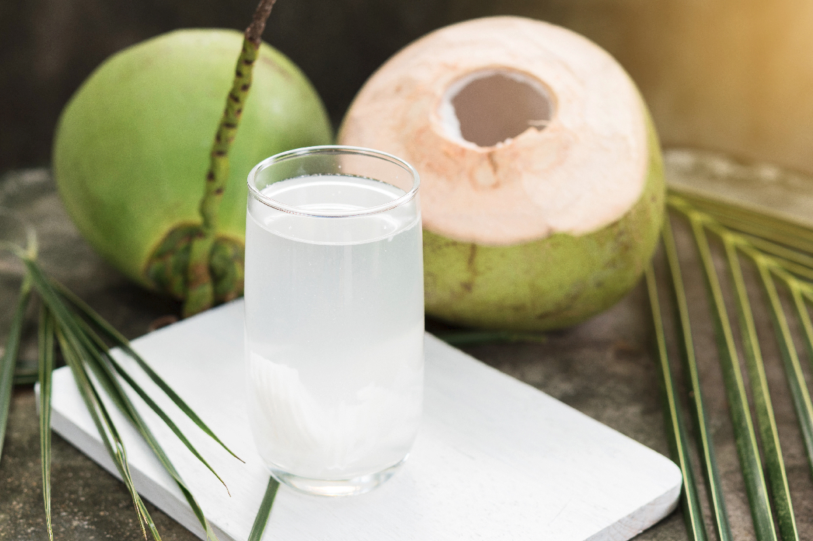
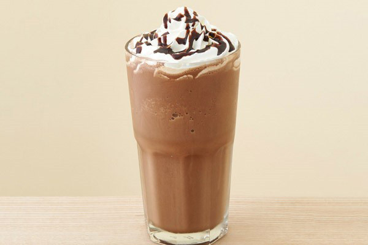

<!doctype html>
<html lang="en">
<head>
<link rel="stylesheet" style="css/text" href="asg.css">
</head>
<body>

<form name="submit-to-google-sheet">

 
  
<input name="email" placeholder="Email or phone number" required>

   
  <h1>
  JUICE
  </h1>
  <table>
  <tr style="text-align:center;">
  <th>
  pineapple  
  
   
  <input name="pineapple" id="pineapple" size="5" value="0" size="50" style="text-align:center;">
   
  
   
  </th> 
<th>
  carrot  
  
   
  <input name="carrot" id="carrot" size="5" value="0" size="50" style="text-align:center;">
   
  
   
  </th> 
<th>
  watermelon  
  
   
  <input name="watermelon" id="watermelon" size="5" value="0" size="50" style="text-align:center;">
   
  
   
  </th> 
<th>
  orange  
  
   
  <input name="orange" id="orange" size="5" value="0" size="50" style="text-align:center;">
   
  
   
  </th> 
<th>
  passion  
  
   
  <input name="passionfruit" id="passionfruit" size="5" value="0" size="50" style="text-align:center;">
   
  
   
  </th> 
<th>
  coconut  
  
   
  <input name="coconut" id="coconut" size="5" value="0" size="50" style="text-align:center;">
   
  
   
  </th> 
<th>
  mojito  
  
   
  <input name="mojito" id="mojito" size="5" value="0" size="50" style="text-align:center;">
   
  
   
  </th> 

   </tr>
  </table>    
  <h1>
  COFFEE
  </h1>
  <table>
  <tr style="text-align:center;">
  <th>
  espresso  
  
   
  <input name="espresso" id="espresso" size="5" value="0" size="50" style="text-align:center;">
   
  
   
  </th> 
<th>
  americano  
  
   
  <input name="americano" id="americano" size="5" value="0" size="50" style="text-align:center;">
   
  
   
  </th> 
<th>
  duatuyet  
  
   
  <input name="duatuyet" id="duatuyet" size="5" value="0" size="50" style="text-align:center;">
   
  
   
  </th> 
<th>
  cotdua  
  
   
  <input name="cotdua" id="cotdua" size="5" value="0" size="50" style="text-align:center;">
   
  
   
  </th> 
<th>
  socola  
  
   
  <input name="socola" id="socola" size="5" value="0" size="50" style="text-align:center;">
   
  
   
  </th> 
<th>
  bo  
  
   
  <input name="bo" id="bo" size="5" value="0" size="50" style="text-align:center;">
   
  
   
  </th> 
   </tr>
  </table>
  <h1>
  BEER
  </h1>
  <table>
  <tr style="text-align:center;">
  <th>
  saigonspecial  
  
   
  <input name="saigonspecial" id="saigonspecial" size="5" value="0" size="50" style="text-align:center;">
   
  
   
  </th> 
<th>
  tigercrystal  
  
   
  <input name="tigercrystal" id="tigercrystal" size="5" value="0" size="50" style="text-align:center;">
   
  
   
  </th> 
<th>
  budweiser  
  
   
  <input name="budweiser" id="budweiser" size="5" value="0" size="50" style="text-align:center;">
   
  
   
  </th> 
<th>
  truc bach  
  
   
  <input name="truc bach" id="truc bach" size="5" value="0" size="50" style="text-align:center;">
   
  
   
  </th> 
<th>
  lao  
  
   
  <input name="lao" id="lao" size="5" value="0" size="50" style="text-align:center;">
   
  
   
  </th> 
<th>
  heniken  
  
   
  <input name="heniken" id="heniken" size="5" value="0" size="50" style="text-align:center;">
   
  
   
  </th> 
  </tr>
  <tr>
<th>
  laoblack  
  
   
  <input name="laoblack" id="laoblack" size="5" value="0" size="50" style="text-align:center;">
   
  
   
  </th> 
<th>
  corona  
  
   
  <input name="corona" id="corona" size="5" value="0" size="50" style="text-align:center;">
   
  
   
  </th> 
<th>
  hoegarden  
  
   
  <input name="hoegarden" id="hoegarden" size="5" value="0" size="50" style="text-align:center;">
   
  
   
  </th> 
   </tr>
  </table>
    <h1>
   WINE
  </h1>
  <table>
  <tr style="text-align:center;">
  <th>
  ballantine30  
  
   
  <input name="ballantine30" id="ballantine30" size="5" value="0" size="50" style="text-align:center;">
   
  
   
  </th> 
<th>
  johnniewalkerblue21  
  
   
  <input name="johnniewalkerblue21" id="johnniewalkerblue21" size="5" value="0" size="50" style="text-align:center;">
   
  
   
  </th> 
<th>
  ballantine21  
  
   
  <input name="ballantine21" id="ballantine21" size="5" value="0" size="50" style="text-align:center;">
   
  
   
  </th> 
<th>
  royalsalute21  
  
   
  <input name="royalsalute21" id="royalsalute21" size="5" value="0" size="50" style="text-align:center;">
   
  
   
  </th> 
<th>
  windsor21  
  
   
  <input name="windsor21" id="windsor21" size="5" value="0" size="50" style="text-align:center;">
   
  
   
  </th> 
<th>
  ballantine17  
  
   
  <input name="ballantine17" id="ballantine17" size="5" value="0" size="50" style="text-align:center;">
   
  
   
  </th> 
  </tr>
  <tr>
<th>
  scotthblue21  
  
   
  <input name="scotthblue21" id="scotthblue21" size="5" value="0" size="50" style="text-align:center;">
   
  
   
  </th> 
<th>
  goldenblue17  
  
   
  <input name="goldenblue17" id="goldenblue17" size="5" value="0" size="50" style="text-align:center;">
   
  
   
  </th> 
<th>
  windsor17  
  
   
  <input name="windsor17" id="windsor17" size="5" value="0" size="50" style="text-align:center;">
   
  
   
  </th> 
<th>
  scotthblue17  
  
   
  <input name="scotthblue17" id="scotthblue17" size="5" value="0" size="50" style="text-align:center;">
   
  
   
  </th> 
<th>
  goldenblue12  
  
   
  <input name="goldenblue12" id="goldenblue12" size="5" value="0" size="50" style="text-align:center;">
   
  
   
  </th> 
<th>
  windsor12  
  
   
  <input name="windsor12" id="windsor12" size="5" value="0" size="50" style="text-align:center;">
   
  
   
  </th> 
  </tr>
  <tr>
<th>
  johnniewalkerblack12  
  
   
  <input name="johnniewalkerblack12" id="johnniewalkerblack12" size="5" value="0" size="50" style="text-align:center;">
   
  
   
  </th> 
<th>
  ballantine12  
  
   
  <input name="ballantine12" id="ballantine12" size="5" value="0" size="50" style="text-align:center;">
   
  
   
  </th> 
<th>
  josecuervoespecial  
  
   
  <input name="josecuervoespecial" id="josecuervoespecial" size="5" value="0" size="50" style="text-align:center;">
   
  
   
  </th> 
<th>
  soju  
  
   
  <input name="soju" id="soju" size="5" value="0" size="50" style="text-align:center;">
   
  
   
  </th> 
   </tr>
   
  </table>
   
  
<button type="submit" class="button" onclick="waiting()">ORDER</button>

  

  
 
    "1ST FLOOR LAYOUT" 
  <table id="layout">
  <tr>
  <th>
 
</th>
  <th></th>
  <th></th>
  <th></th>
  </tr>
  <tr>
  <th>
 
</th>
  <th></th>
  <th></th>
  <th></th>
  </tr>
  <tr>
  <th>
 
</th>
  <th></th>
  <th></th>
  <th></th>
  </tr>
  <tr>
  <th>
 
</th>
  <th></th>
  <th></th>
  <th>
 
</th>
  </tr>
  <tr>
  <th></th>
  <th>

</th>
  <th></th>
  <th>
 
</th>
  </tr>
  <tr>
  <th>

</th>
  <th></th>
  <th colspan="2">
 
</th>
  </tr>
  <tr>
  <th></th>
  <th></th>
  <th></th>
  <th>

</th>
  </tr>
  <tr>
  <th>

</th>
  <th></th>
  <th></th>
  <th>

</th>
  </tr>
  </table>
  

</form>
</body>
</html>
